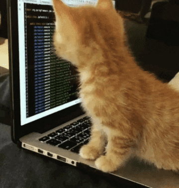

  
  <h2>hello there </h2>
  

## :computer: About me

- I'm a high school student in Canada 🇨🇦
- My nationality is ex-Yugoslavian 🇷🇸 🇦🇱 🇭🇷 🇲🇪
- I am fluent in C#, Java, Python, and Lua 👨‍💻
- I am interested in learning C and C++ 🤓

## :scroll: Languages & Tools

  
  
  
  
  
  
  
  

## :bar_chart: Statistics

## :snake: Contributions

